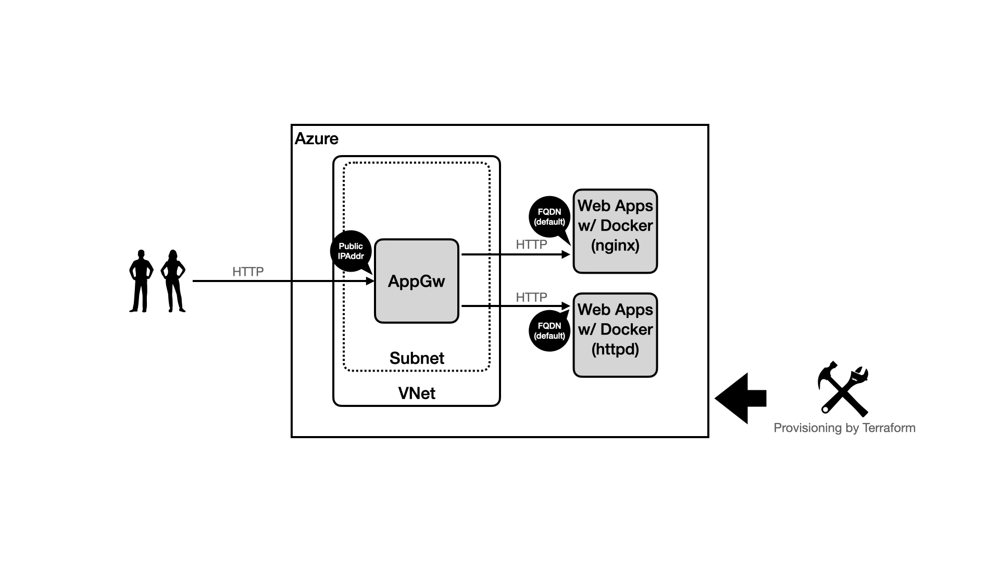

# Example for Azure Application Gateway



## How to set up

You need one Azure subscription you can fully manage.  
And you need to get credentials after setting up system accounts for provisioning as described below.

### How to set up your Azure service principal

You should create an Azure service principal that added follows roles.

- `Contributor`

### How to set up your local environment

You need create the `.env` file as follows.

```
CURRENT_ENV_NAME=production
PROJECT_UNIQUE_ID=YOUR_UNIQUE_ID_AS_A_RESOURCE_PREFIX
AZURE_DEFAULT_LOCATION=westus2
ARM_SUBSCRIPTION_ID=********
ARM_CLIENT_ID=********
ARM_CLIENT_SECRET=********
ARM_TENANT_ID=********
```

```console
echo TF_VAR_allowed_ipaddr_list='["'$(curl -sL ifconfig.io)'/32"]' >> .env
```

If you are using Linux, you should add UID and GID to the `.env` file as follows.

```shellsession
test $(uname -s) = 'Linux' && echo "UID=$(id -u)\nGID=$(id -g)" >> .env
```

## How to run

Now you can make provisioning as follows.

```shellsession
docker-compose up
docker-compose run provisioning terraform plan
```
